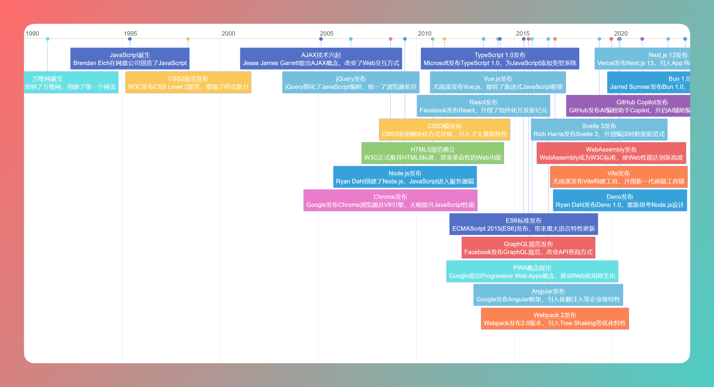

# 前端发展历史时间线

这是一个基于 `Vis.js` 创建的前端发展历史时间线项目，展示了前端技术的演变过程。通过时间线的形式，用户可以直观地了解各类技术、框架、工具和标准的出现时间及其分类。

## 功能特点

- **时间线展示**：以时间轴的形式展示前端技术的发展历史。
- **分类标识**：不同类型的技术（如标准、框架、工具等）使用不同的颜色和样式进行区分。
- **交互功能**：
  - 支持缩放时间线（最小缩放范围为一年，最大缩放范围为 40 年）。
  - 支持垂直滚动查看更多内容。
  - 时间线内容可堆叠显示，避免重叠。

## 使用方法

1. 打开项目文件夹，直接在浏览器中打开 `index.html` 文件。
2. 时间线会自动加载并显示内容。
3. 使用鼠标滚轮缩放时间线，或拖动时间线查看不同时间段的内容。

## 技术说明

本项目使用了以下技术：

- **Vis.js**：用于创建交互式时间线。
- **HTML/CSS**：用于页面结构和样式设计。
- **JavaScript**：用于时间线数据的加载和交互功能的实现。
- **模块化数据管理**：时间线数据存储在 `timeline-data.js` 文件中，便于维护和扩展。

## 自定义

您可以通过以下方式自定义时间线内容：

1. 修改 `timeline-data.js` 文件中的 `timelineEvents` 数组，添加或编辑时间线事件。
2. 修改 `eventColors` 对象，调整不同分类的颜色样式。
3. 修改 `index.html` 中的 `options` 配置，调整时间线的显示范围、缩放级别等参数。

## 注意事项

- 本项目使用 CDN 引入 `Vis.js` 库，因此需要联网才能正常运行。
- 时间线数据需要符合 `Vis.js` 的数据格式，确保数据结构正确。

## 示例截图

以下是项目运行时的示例截图：

*图1：时间线的初始视图*